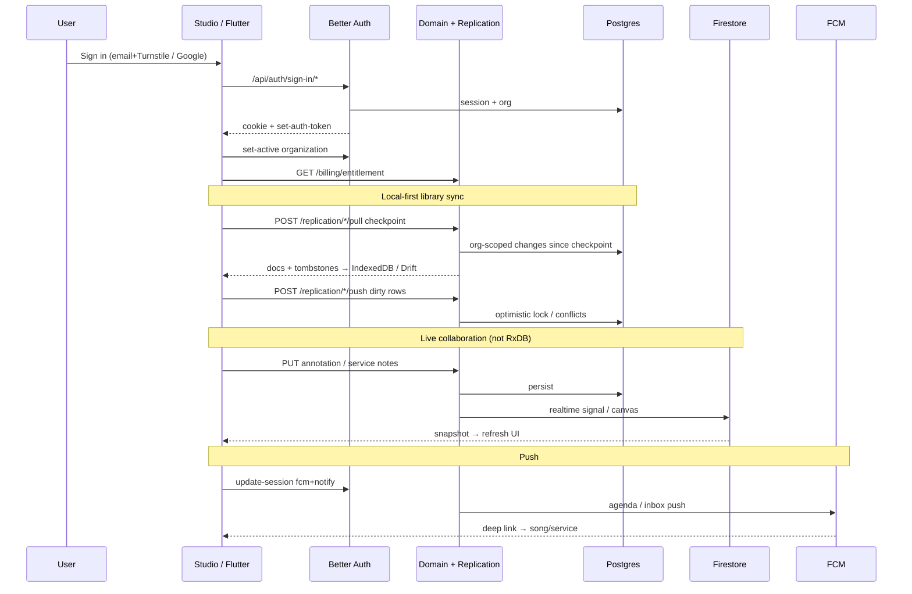
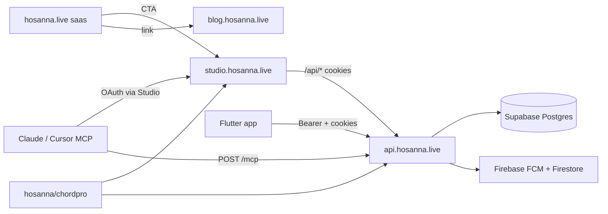

# System diagrams

## Full system

```mermaid
flowchart TB
  subgraph CLIENTS["Clients"]
    direction TB
    STUDIO["Hosanna Studio<br/>Hosana-dashboard · Preact/Vite PWA<br/>studio.hosanna.live"]
    FLUTTER["Hosanna Musician App<br/>Flutter · Riverpod · Drift/SQLite<br/>iOS / Android / Desktop"]
    SAAS["Marketing Site<br/>hosanna-saas · Vite/React<br/>hosanna.live"]
    BLOG["Blog<br/>hosanna-blog · Astro<br/>blog.hosanna.live"]
    MCP_CLI["MCP Clients<br/>Claude · ChatGPT · Cursor"]
  end

  subgraph SHARED["Shared ChordPro"]
    CHORDPRO["@hosanna/chordpro<br/>hosanna-shared<br/>parser · renderer · editor<br/>formatter · instruments · diff"]
    DART_CP["Dart ChordPro port<br/>Flutter songs/domain/chordpro"]
  end

  subgraph API["Hosanna-server · api.hosanna.live<br/>Express · Prisma · Better Auth · Vercel / Docker"]
    direction TB

    subgraph ENTRY["Entry"]
      EXPRESS["Express App<br/>Helmet · CORS · Rate limits<br/>/api · /mcp · /api/auth"]
      MCP_HTTP["MCP HTTP /mcp<br/>OAuth 2.1 + tools"]
      CRON["Vercel Cron<br/>purge-trash · agenda-reminders"]
    end

    subgraph AUTH_LAYER["Auth · Better Auth"]
      BA["Email/Password · Google OAuth<br/>2FA · Turnstile · Org/Teams<br/>Bearer + Cookies · JWT/JWKS"]
      RBAC["RBAC<br/>owner · admin · teamLeader<br/>editor · musician · guest"]
      SUB_GATE["Subscription Gate<br/>Stripe plan: cloud"]
    end

    subgraph DOMAIN_API["REST Domain"]
      SONGS["/api/songs"]
      FOLDERS["/api/folders"]
      SERVICES["/api/services + notes"]
      ANNOT["/api/annotation"]
      TRASH["/api/trash"]
      BACKUP["/api/backup"]
      BILLING["/api/billing/entitlement"]
      YT_API["/api/youtube"]
      CIFRA["/api/cifra"]
      AI_API["/api/ai<br/>chat stream · settings · memory"]
      NOTIF["/api/notifications"]
    end

    subgraph SYNC["Replication · RxDB-style"]
      REPL["/api/replication/{collection}/pull|push<br/>songs · folders · collections<br/>services · agendaEvents"]
      CACHE["syncCache<br/>per-tenant checkpoints"]
    end

    subgraph SVCS["Services"]
      S_SONG["Song / Folder / Service"]
      S_REPL["ReplicationService"]
      S_AI["AiChat + Memory + BYOK"]
      S_ANN["AnnotationService"]
      S_AGENDA["AgendaReminders"]
      S_EMAIL["Email · Handlebars"]
      S_BACKUP["BackupService"]
    end
  end

  subgraph DATA["Data Plane"]
    PG[("PostgreSQL<br/>Supabase Pooler :6543<br/>Prisma models + soft-delete")]
    SUPA_STOR["Supabase Storage<br/>avatars bucket"]
    FS[("Cloud Firestore<br/>notes ping · annotation docs")]
    IDB[("Studio IndexedDB<br/>local-first collections")]
    SQLITE[("Flutter Drift/SQLite<br/>songs · folders · collections · services")]
  end

  subgraph EXT["External Services"]
    STRIPE["Stripe<br/>org subscriptions · webhooks · trial"]
    RESEND["Resend<br/>auth · org · billing emails"]
    FCM["Firebase FCM<br/>push notifications"]
    TURNSTILE["Cloudflare Turnstile<br/>captcha"]
    GOOGLE["Google OAuth"]
    YT["YouTube Data API v3"]
    AI_PROV["LLM BYOK<br/>OpenAI · Anthropic · Google · DeepSeek"]
    SCRAPE["Cifra Club / Ultimate Guitar"]
    META["MusicBrainz · DuckDuckGo"]
    POSTHOG["PostHog<br/>Studio analytics"]
    VERCEL_A["Vercel Analytics<br/>Marketing"]
  end

  SAAS -->|"CTA → Studio signup"| STUDIO
  SAAS -->|"footer link"| BLOG
  STUDIO -->|"cookies · /api/auth/*"| BA
  STUDIO -->|"REST CRUD · AI stream · backup"| DOMAIN_API
  STUDIO -->|"15s + online + local changes"| REPL
  FLUTTER -->|"Dio cookies + Bearer"| BA
  FLUTTER -->|"pull-first sync"| REPL
  FLUTTER -->|"notes · annotations · entitlement"| DOMAIN_API
  MCP_CLI -->|"OAuth consent via Studio"| STUDIO
  MCP_CLI -->|"POST /mcp"| MCP_HTTP
  CRON -->|"Bearer CRON_SECRET"| EXPRESS

  STUDIO --> CHORDPRO
  EXPRESS --> CHORDPRO
  FLUTTER --> DART_CP
  DART_CP -.->|"ported from"| CHORDPRO

  EXPRESS --> BA
  BA --> RBAC
  BA --> SUB_GATE
  BA --> GOOGLE
  BA --> TURNSTILE
  BA --> STRIPE
  BA --> RESEND
  S_EMAIL --> RESEND

  DOMAIN_API --> SVCS
  REPL --> S_REPL
  S_REPL --> CACHE
  SVCS --> PG
  S_REPL --> PG
  BA --> PG
  EXPRESS --> SUPA_STOR

  STUDIO <-->|"read/write UI"| IDB
  IDB <-->|"push/pull"| REPL
  FLUTTER <-->|"Drift watch"| SQLITE
  SQLITE <-->|"push/pull"| REPL

  S_ANN --> FS
  S_ANN --> PG
  STUDIO -.->|"AI mutates → studio_sync"| REPL
  FLUTTER -->|"listen annotations/notes"| FS
  NOTIF --> FCM
  S_AGENDA --> FCM
  FLUTTER -->|"session.fcm"| FCM
  STUDIO -->|"inbox + FCM"| NOTIF

  AI_API --> S_AI
  S_AI --> AI_PROV
  MCP_HTTP --> SVCS
  MCP_HTTP --> CHORDPRO
  MCP_HTTP --> YT
  MCP_HTTP --> META
  YT_API --> YT
  CIFRA --> SCRAPE

  STUDIO --> POSTHOG
  SAAS --> VERCEL_A
```

## Auth + sync sequence

```mermaid
sequenceDiagram
  participant U as User
  participant C as Studio / Flutter
  participant BA as Better Auth
  participant API as Domain + Replication
  participant PG as Postgres
  participant FS as Firestore
  participant FCM as FCM

  U->>C: Sign in (email+Turnstile / Google)
  C->>BA: /api/auth/sign-in/*
  BA->>PG: session + org
  BA-->>C: cookie + set-auth-token
  C->>BA: set-active organization
  C->>API: GET /billing/entitlement

  Note over C,PG: Local-first library sync
  C->>API: POST /replication/*/pull checkpoint
  API->>PG: org-scoped changes since checkpoint
  API-->>C: docs + tombstones → IndexedDB / Drift
  C->>API: POST /replication/*/push dirty rows
  API->>PG: optimistic lock / conflicts

  Note over C,FS: Live collaboration (not RxDB)
  C->>API: PUT annotation / service notes
  API->>PG: persist
  API->>FS: realtime signal / canvas
  FS-->>C: snapshot → refresh UI

  Note over C,FCM: Push
  C->>BA: update-session fcm+notify
  API->>FCM: agenda / inbox push
  FCM-->>C: deep link → song/service
```

## Ecosystem funnel (marketing → product)

```mermaid
flowchart LR
  M[hosanna.live saas] -->|CTA| S[studio.hosanna.live]
  M -->|link| B[blog.hosanna.live]
  S -->|/api/* cookies| A[api.hosanna.live]
  F[Flutter app] -->|Bearer + cookies| A
  AI[Claude / Cursor MCP] -->|OAuth via Studio| S
  AI -->|POST /mcp| A
  A --> DB[(Supabase Postgres)]
  A --> FB[Firebase FCM + Firestore]
  CP[hosanna/chordpro] --> S
  CP --> A
```
